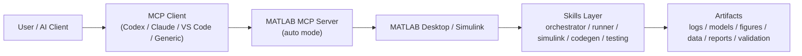
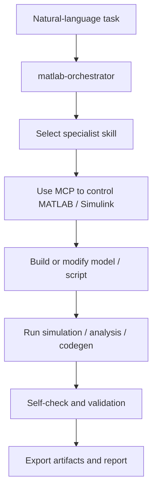

# MATLAB Agent Skills

> A production-minded Codex skills suite for MATLAB, Simulink, code generation, engineering simulation, research reproduction, and closed-loop validation.

[](https://github.com/wzyn20051216/matlab-agent-skills/actions/workflows/matlab-validation.yml)
[](https://github.com/wzyn20051216/matlab-agent-skills/actions/workflows/repository-checks.yml)
[](LICENSE)
[](https://www.mathworks.com/products/matlab.html)

`matlab-agent-skills` turns MATLAB from a tool you manually drive into an agent-ready engineering workbench. It packages MATLAB / Simulink / toolbox workflows as Codex skills with one hard rule: every task should end with a runnable command, captured logs, saved artifacts, and an acceptance check.

This project is built for developers, researchers, and model-based engineering teams who want agents to do real MATLAB work, not just write plausible `.m` snippets.

Full capability statement: this repository is open source, but its full workflow potential depends on a properly licensed MATLAB R2026a installation plus the required MathWorks toolboxes, support packages, and third-party embedded toolchains. Without a valid licensed environment, some MCP control, Simulink, code generation, and hardware-in-the-loop flows will only be partially available or unavailable.

- Chinese project introduction: `docs/SKILLS_INTRO_ZH.md`
- Short-video script (Chinese): `docs/SHORT_VIDEO_SCRIPT_ZH.md`
- Official MATLAB MCP guide: `docs/MCP_EXISTING_SESSION_ZH.md`
- Changelog: `CHANGELOG.md`

## Highlights

- MCP-first MATLAB / Simulink automation, not prompt-only code generation
- One-command client install for `Codex` and `Claude Code`
- Auto-mode MATLAB MCP setup that can reuse or automatically start MATLAB desktop
- Simulink modeling, tuning, validation, and codegen-oriented workflows
- Engineering artifacts by default: logs, figures, data, reports, validation JSON

## Why This Exists

Modern MATLAB ships with a deep engineering stack: Simulink, MATLAB Coder, Embedded Coder, ROS Toolbox, Control System Toolbox, Optimization Toolbox, Deep Learning Toolbox, Signal Processing Toolbox, Computer Vision Toolbox, and more. This repository is currently validated on MATLAB R2026a, while the core workflow is designed to stay compatible with recent MATLAB releases whenever APIs allow.

The repository can still be inspected, extended, and partially validated in lighter environments, but the complete intended experience requires a genuine licensed MATLAB R2026a setup.

This repository provides that workflow layer:

- Route fuzzy user requests to the right MATLAB specialist skill.
- Use official MATLAB MCP auto-mode control as the default MATLAB / Simulink execution path on this machine.
- Run MATLAB from the terminal with logs and reproducible output folders.
- Build and simulate Simulink models automatically.
- Reproduce open-source paper projects with manifests and measurable deltas.
- Generate code through MATLAB Coder / Embedded Coder style workflows.
- Close every task with tests, smoke checks, or artifact validation.

## Installation

Clone the repository:

```powershell
git clone https://github.com/wzyn20051216/matlab-agent-skills.git
cd matlab-agent-skills
```

Deploy the skills into your local Codex skill directory:

```powershell
powershell -ExecutionPolicy Bypass -File .\scripts\Sync-Skills.ps1
```

Windows one-liner bootstrap:

```powershell
irm https://raw.githubusercontent.com/wzyn20051216/matlab-agent-skills/main/scripts/Bootstrap-MatlabAgentSkills.ps1 | iex
```

## Clients

Supported MCP client integration paths in this repository:

| Client | Status | Setup |
| --- | --- | --- |
| `Codex` | Ready | One-command install |
| `Claude Code` | Ready | One-command install |
| `VS Code` | Ready | Writes project-local `.vscode/mcp.json` |
| `Generic MCP clients` | Ready | Writes project-local `.mcp.json` |
| `Claude Desktop` | Manual | Prefer official `.mcpb` bundle from MathWorks release |

One-command install for `Codex` + `Claude Code`:

```powershell
powershell -ExecutionPolicy Bypass -File .\scripts\Install-MatlabMcpClients.ps1 `
  -Clients codex,claude
```

Auto-detect installed clients and also write a generic `.mcp.json`:

```powershell
powershell -ExecutionPolicy Bypass -File .\scripts\Install-MatlabMcpClients.ps1 `
  -Clients auto
```

Write project-local `VS Code` MCP config:

```powershell
powershell -ExecutionPolicy Bypass -File .\scripts\Install-MatlabMcpClients.ps1 `
  -Clients vscode `
  -ProjectPath .
```

## Quick Start

Set up official MATLAB MCP auto-mode control:

```powershell
powershell -ExecutionPolicy Bypass -File .\scripts\Setup-MatlabMcpExistingSession.ps1 `
  -McpServerName matlab-official
```

If auto-discovery fails, provide only the missing path explicitly:

```powershell
powershell -ExecutionPolicy Bypass -File .\scripts\Setup-MatlabMcpExistingSession.ps1 `
  -ServerExePath "C:\path\to\matlab-mcp-server-windows-x64.exe" `
  -MatlabRoot "C:\Program Files\MATLAB\R2026a"
```

Verify MCP readiness:

```powershell
powershell -ExecutionPolicy Bypass -File .\scripts\Test-MatlabMcpExistingSession.ps1
```

Run local validation:

```powershell
powershell -ExecutionPolicy Bypass -File .\scripts\Test-MatlabSkills.ps1
```

Run the full embedded acceptance chain for MATLAB + STM32 / Raspberry Pi + CubeMX / Keil / VS Code:

```powershell
$matlabExe = (Get-Command matlab -ErrorAction SilentlyContinue).Source
powershell -ExecutionPolicy Bypass -File .\scripts\Test-MatlabEmbeddedStack.ps1 -MatlabPath $matlabExe
```

Run a custom MATLAB script with captured logs:

```powershell
powershell -ExecutionPolicy Bypass -File .\scripts\Invoke-MatlabBatch.ps1 -Script .\path\to\script.m
```

## Architecture



## Workflow



## Skill Suite

| Skill | Purpose |
| --- | --- |
| `matlab-orchestrator` | Entry point and router for MATLAB tasks. |
| `matlab-runner` | Batch execution, logs, toolbox inventory, smoke tests. |
| `matlab-data-analysis` | Tables, statistics, fitting, visualization, paper figures. |
| `matlab-simulink-modeling` | `.slx` creation, topology edits, simulation, signal checks. |
| `matlab-codegen-deploy` | MEX, C/C++, embedded, GPU, HDL-oriented code generation. |
| `matlab-control-optimization` | Control design, identification, MPC, constrained optimization. |
| `matlab-robotics-autonomy` | ROS, robotics, navigation, UAV, sensor fusion workflows. |
| `matlab-signal-vision-ai` | Signal, image, vision, lidar, medical imaging, deep learning. |
| `matlab-testing-ci` | `matlab.unittest`, Simulink Test patterns, GitHub Actions, acceptance reports. |

## What Validation Checks

The smoke test currently verifies:

- MATLAB R2026a can be launched from the terminal.
- Installed toolbox inventory can be exported to JSON.
- Feature probe can distinguish direct-import support, hardware blockset presence, and local agent skill availability.
- A deterministic numeric fitting task passes tolerance checks.
- MATLAB Coder can generate standalone C source artifacts in `GenCodeOnly` mode.
- Figure export produces a nonempty PNG artifact.
- `.mat` export produces a nonempty data artifact.
- Simulink can create, save, and simulate a minimal model when licensed.
- Simulink Coder can generate generic C code from a minimal model when licensed.
- STM32 / Raspberry Pi hardware support can be probed from MATLAB and exported to JSON.
- VS Code / STM32CubeMX / Keil can be discovered and checked as an embedded toolchain bundle.
- Key embedded extensions such as `cortex-debug`, `cpptools`, `keil-assistant`, and STM32 VS Code integration can be audited.
- STM32 code generation readiness checks MATLAB-registered CubeMX, target hardware names, GNU Tools for STM32, CMSIS, CMSIS-DSP, Cube firmware packages, and `.ioc` binding assumptions.

Artifacts are written under:

```text
artifacts/
  logs/
  validation/
```

## Repository Layout

```text
skills/                 # Codex skill definitions
scripts/                # PowerShell automation wrappers
matlab/validation/      # MATLAB smoke tests and reproduction templates
docs/                   # Architecture, sources, validation, release notes
evals/                  # Skill evaluation prompts
.github/workflows/      # GitHub Actions validation example
```

## Contributing

Contributions are welcome when they make MATLAB agent workflows more executable, measurable, or reproducible. See [CONTRIBUTING.md](CONTRIBUTING.md) and [ROADMAP.md](ROADMAP.md).

Security policy: [SECURITY.md](SECURITY.md)

## Paper Reproduction Mode

For open-source papers and engineering examples, the expected loop is:

1. Record paper URL, code URL, dataset URL, commit hash, MATLAB release, and toolbox list.
2. Run the smallest official example first.
3. Reproduce one figure or table before scaling up.
4. Save raw logs, processed results, generated figures, and `manifest.json`.
5. Report numerical deltas instead of hand-waving visual similarity.

The helper template is:

```matlab
manifestPath = reproducible_project_template("project-name", "https://example.com/source");
```

## Design Principles

- Task-first skills, not toolbox-name wrappers.
- Official MathWorks docs and local MATLAB probes beat memory.
- Forum and blog knowledge is useful only after local verification.
- Every generated artifact should be inspectable and reproducible.
- CI should run the same commands a developer runs locally.

## Roadmap

- Add packaged `.skill` releases.
- Add benchmark viewer outputs for representative MATLAB tasks.
- Add real paper reproduction examples with public datasets.
- Add Simulink model topology diff tooling.
- Add code generation golden-output comparison templates.
- Add self-hosted runner guide for licensed MATLAB/Simulink CI.
- Add more R2026a-specific capability probes as MathWorks documentation evolves.

## Related Work

- [MATLAB Agentic Toolkit](https://github.com/matlab/matlab-agentic-toolkit)
- [Simulink Agentic Toolkit](https://github.com/matlab/simulink-agentic-toolkit)
- [MATLAB Actions](https://github.com/matlab-actions)

This project is not an official MathWorks product. It is an independent, developer-oriented skill suite designed to make MATLAB R2026a easier for coding agents to use responsibly.

## License

MIT License. See [LICENSE](LICENSE).
